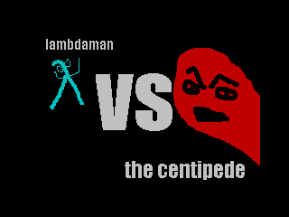

lambdaman
=========

A little game to test my ZX Spectrum haskell packages.

This game is almost a direct port of the centipede example from this excellent
series of ZX Spectrum tutorials:
https://chuntey.wordpress.com/2012/12/18/how-to-write-zx-spectrum-games-chapter-1/

Licence
-------

Released under the MIT licence; see LICENSE for details.

Copywright (c) Daniel P. Wright 2015.
